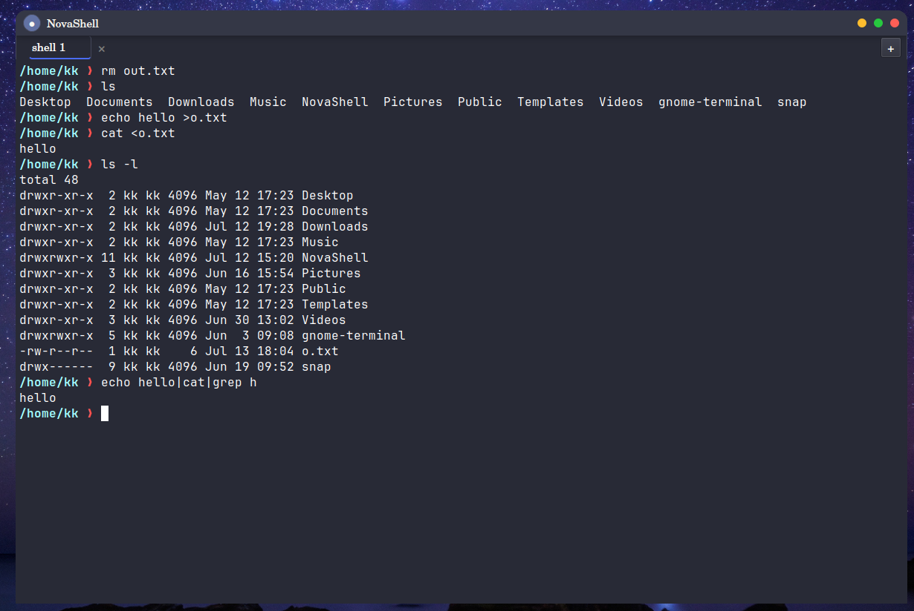
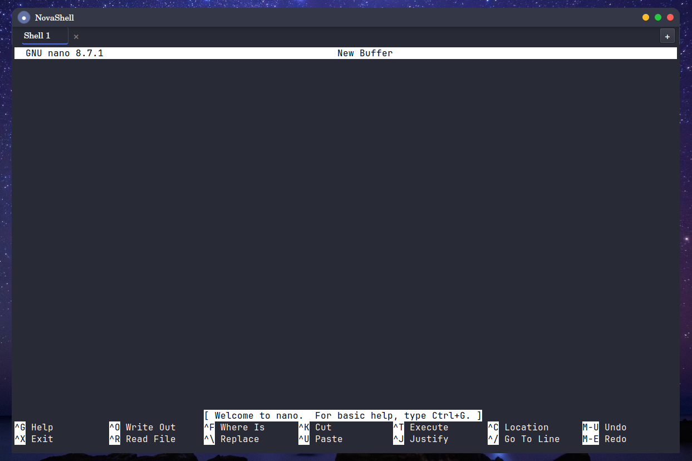
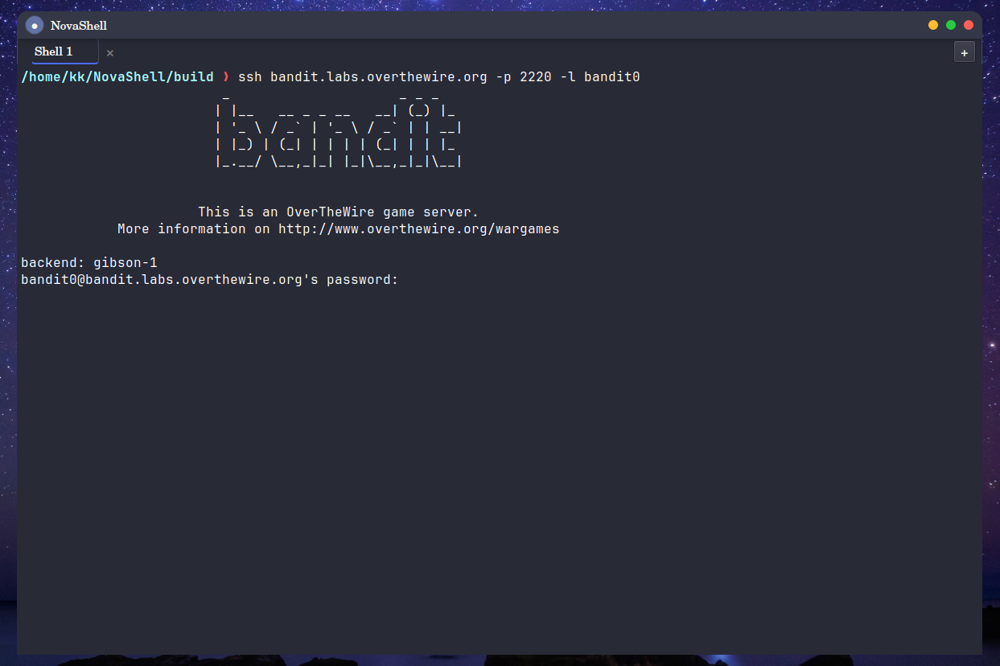

#  NovaShell

NovaShell is a Linux shell and Qt-based terminal emulator built from scratch in c and c++.

The project consists of two major components:

- **NovaShell** - a POSIX shell supporting pipelines,redirection and builtin commands.
- **NovaShell GUI** - a Qt6 terminal emulator that runs the shell inside a pseudo terminal(PTY).

The goal of the project is to understand how modern terminals and shells work internally instead of relying on existing terminal widgets.

## Features

### shell
 
 - Command execution
 - Built-in commands
 - Arbitary-length pipelines
 - Input/Output redirection (`<`,`>`,`>>`)
 - Process Management using `fork`,`execvp` and `waitpid`

 ### Terminal Emulator

 - Linux PTY backend
 - ANSI escape sequence parser
 - Scrollback buffer
 - Alternate screen buffer
 - cursor Movement
 - Compatible with SSH sessions(tested with ssh localhost)
 - supports terminal applications such as nano and vim
 - Tab to Autofill
 - Command history

 ### GUI

 - Multiple terminal tabs
 - drag to reorder tabs
 - Theme support
 - supports multiple themes
 - #### KeyBoard shortcuts
    - Ctrl + Shift + c -> copy selection
    - Ctrl + Shift + v -> Paste
    - Ctrl + Shift + T -> new tab
    - Ctrl + Tab -> next Tab
    - Ctrl + Shift + Tab -> previous Tab
    - Ctrl + W -> close tab
 

 ## Screenshots

 ### Main Window



### Running nano



### SSH Session




## ARCHITECTURE
```
╔══════════════════════════════════════════════════════════════════════════════╗
║                            NovaShell v2.0                                   ║
╚══════════════════════════════════════════════════════════════════════════════╝

┌────────────────────────────────────────────────────────────────────────────┐
│                         Qt GUI Layer                                       │
│                                                                            │
│  ┌─────────────────────────────────────────────────────────────────────┐   │
│  │                        MainWindow                                   │   │
│  │   ┌──────────────────────────────────────────────────────────────┐  │   │
│  │   │                        TitleBar                              │  │   │
│  │   │  ┌───────────────┐  ┌──────────┐  ┌──────────────────────┐   │  │   │
│  │   │  │ ThemeSelector │  │  Title   │  │  NavigationButtons   │   │  │   │
│  │   │  │  (7 themes)   │  │          │  │  (_ □ ✕)             │   │  │   │
│  │   │  └───────────────┘  └──────────┘  └──────────────────────┘   │  │   │
│  │   └──────────────────────────────────────────────────────────────┘  │   │
│  │                                                                     │   │
│  │   ┌──────────────────────────────────────────────────────────────┐  │   │
│  │   │                         TabBar                               │  │   │
│  │   │  ┌───────────┐  ┌───────────┐  ┌───────────┐  ┌─────────┐    │  │   │
│  │   │  │ TabButton │  │ TabButton │  │ TabButton │  │   [+]   │    │  │   │
│  │   │  │  Shell 1  │  │  Shell 2  │  │  Shell 3  │  │         │    │  │   │
│  │   │  └───────────┘  └───────────┘  └───────────┘  └─────────┘    │  │   │
│  │   └──────────────────────────────────────────────────────────────┘  │   │
│  │                                                                     │   │
│  │   ┌──────────────────────────────────────────────────────────────┐  │   │
│  │   │                    SessionManager                            │  │   │
│  │   │                   (QStackedWidget)                           │  │   │
│  │   │                                                              │  │   │
│  │   │   ┌────────────────────────────────────────────────────────┐ │  │   │
│  │   │   │                   ShellSession                         │ │  │   │
│  │   │   │                                                        │ │  │   │
│  │   │   │  ┌──────────────────────────────────────────────────┐  │ │  │   │
│  │   │   │  │                 ScreenWidget                     │  │ │  │   │
│  │   │   │  │           (QPainter cell renderer)               │  │ │  │   │
│  │   │   │  │   • Mouse selection    • Cursor blink            │  │ │  │   │
│  │   │   │  │   • Wheel scrollback   • Key forwarding          │  │ │  │   │
│  │   │   │  │   • Ctrl+Shift+C/V     • Window resize           │  │ │  │   │
│  │   │   │  └───────────────────┬──────────────────────────────┘  │ │  │   │
│  │   │   │                      │ reads                           │ │  │   │
│  │   │   │  ┌───────────────────▼──────────────────────────────┐  │ │  │   │
│  │   │   │  │                ScreenBuffer                      │  │ │  │   │
│  │   │   │  │                                                  │  │ │  │   │
│  │   │   │  │  ┌─────────────────┐  ┌─────────────────────┐    │  │ │  │   │
│  │   │   │  │  │  Primary Buffer │  │  Alternate Buffer   │    │  │ │  │   │
│  │   │   │  │  │   (ScreenCell   │  │   (vim/nano/htop)   │    │  │ │  │   │
│  │   │   │  │  │    grid rows×cols│  │    grid rows×cols) │    │  │ │  │   │
│  │   │   │  │  └─────────────────┘  └─────────────────────┘    │  │ │  │   │
│  │   │   │  │  ┌─────────────────────────────────────────────┐ │  │ │  │   │
│  │   │   │  │  │           Scrollback (2000 lines)           │ │  │ │  │   │
│  │   │   │  │  └─────────────────────────────────────────────┘ │  │ │  │   │
│  │   │   │  └───────────────────▲──────────────────────────────┘  │ │  │   │
│  │   │   │                      │ writes                          │ │  │   │
│  │   │   │  ┌───────────────────┴──────────────────────────────┐  │ │  │   │
│  │   │   │  │               ScreenRenderer                     │  │ │  │   │
│  │   │   │  │                                                  │  │ │  │   │
│  │   │   │  │  ScreenRenderer.cpp ── main loop, C0 controls    │  │ │  │   │
│  │   │   │  │  RendererESC.cpp    ── ESC dispatcher            │  │ │  │   │
│  │   │   │  │  RendererCSI.cpp    ── cursor/erase/insert/scroll│  │ │  │   │
│  │   │   │  │  RendererSGR.cpp    ── colours, bold, reverse    │  │ │  │   │
│  │   │   │  │  RendererOSC.cpp    ── window title (consumed)   │  │ │  │   │
│  │   │   │  │  RendererUtils.cpp  ── param(), flushText()      │  │ │  │   │
│  │   │   │  └───────────────────▲──────────────────────────────┘  │ │  │   │
│  │   │   │                      │ raw bytes                       │ │  │   │
│  │   │   │  ┌───────────────────┴──────────────────────────────┐  │ │  │   │
│  │   │   │  │                 PtySession                       │  │ │  │   │
│  │   │   │  │   posix_openpt → grantpt → unlockpt → ptsname    │  │ │  │   │
│  │   │   │  │   fork → setsid → dup2(slave, stdin/out/err)     │  │ │  │   │
│  │   │   │  │   QSocketNotifier → read(masterFd)               │  │ │  │   │
│  │   │   │  │   TIOCSWINSZ on resize                           │  │ │  │   │
│  │   │   │  └───────────────────┬──────────────────────────────┘  │ │  │   │
│  │   │   └────────────────────  │  ───────────────────────────────┘ │  │   │
│  │   └────────────────────────  │  ─────────────────────────────────┘  │   │
│  └──────────────────────────────│──────────────────────────────────────┘   │
└─────────────────────────────────│──────────────────────────────────────────┘
                                  │ PTY master/slave
                    ┌─────────────▼───────────────┐
                    │       Linux Kernel          │
                    │    PTY Line Discipline      │
                    │  (echo, signal, buffering)  │
                    └─────────────┬───────────────┘
                                  │ stdin/stdout/stderr
┌─────────────────────────────────▼───────────────────────────────────────────┐
│                         NovaShell CLI                                       │
│                                                                             │
│   shell.c ── main loop, readline, dynamic prompt, history, Tab completion   │
│       │                                                                     │
│       ▼                                                                     │
│   ┌───────────────────────────────────────────────────────────────────┐     │
│   │                      Engine (libNovaShellCore.a)                  │     │
│   │                                                                   │     │
│   │  ┌─────────────┐    ┌──────────────┐    ┌────────────────────┐    │     │
│   │  │  parser.c   │    │ environment.c│    │    memory.c        │    │     │
│   │  │             │    │              │    │                    │    │     │
│   │  │ • Heap alloc│    │ • $VAR expand│    │ • free_argv()      │    │     │
│   │  │ • Quoting   │    │ • getenv()   │    │ • operator guard   │    │     │
│   │  │ • Escaping  │    │ • strdup()   │    │                    │    │     │
│   │  │ • Operators │    └──────────────┘    └────────────────────┘    │     │
│   │  └──────┬──────┘                                                  │     │
│   │         │                                                         │     │
│   │         ▼                                                         │     │
│   │  ┌─────────────┐                                                  │     │
│   │  │ executor.c  │                                                  │     │
│   │  │             │                                                  │     │
│   │  │ • Pipeline  │                                                  │     │ 
│   │  │   validation│                                                  │     │
│   │  │ • Route to  │                                                  │     │
│   │  │   builtin / │                                                  │     │
│   │  │   extern    │                                                  │     │
│   │  └──────┬──────┘                                                  │     │
│   │         │                                                         │     │
│   │    ┌────┴────────────────────┐                                    │     │
│   │    │                         │                                    │     │
│   │    ▼                         ▼                                    │     │
│   │  ┌─────────────┐    ┌──────────────────┐                          │     │
│   │  │ builtins.c  │    │   process.c      │                          │     │
│   │  │             │    │                  │                          │     │
│   │  │ • cd,cd -   │    │ • fork()         │                          │     │
│   │  │ • exit      │    │ • pipe()         │                          │     │
│   │  └─────────────┘    │ • waitpid()      │                          │     │ 
│   │                     │ • SIGINT restore │                          │     │
│   │                     └────────┬─────────┘                          │     │
│   │                              │                                    │     │
│   │                              ▼                                    │     │
│   │                     ┌──────────────────┐                          │     │
│   │                     │   launcher.c     │                          │     │
│   │                     │                  │                          │     │
│   │                     │ • execvp()       │                          │     │ 
│   │                     │ • dup2()         │                          │     │
│   │                     │ • <, >, >>       │                          │     │
│   │                     └────────┬─────────┘                          │     │
│   │                              │                                    │     │
│   └──────────────────────────────│────────────────────────────────────┘     │
└─────────────────────────────────┬┘──────────────────────────────────────────┘
                                  │
                    ┌─────────────▼───────────────┐
                    │    Linux Kernel             │
                    │  fork, execvp, waitpid      │
                    │  dup2, pipe, signal         │
                    └─────────────────────────────┘
```

## Project Structure

```
NovaShell/
│
├── README.md
├── Makefile                          # Engine build (gcc, ASan, -Wall -Wextra-Werror)
├── .gitignore
│
├── images/
│   └── screenshot.png
│
├── packaging/
│   ├── novashell.desktop
│   └── novashell.png
│
├── include/                          # Engine public headers
│   ├── core.h                        # shell_execute() interface + extern "C" guard
│   ├── parser.h                      # parse_input()
│   ├── executor.h                    # execute_command(), validate_pipeline()
│   ├── launcher.h                    # launch_process()
│   ├── process.h                     # launch_pipeline()
│   ├── builtins.h                    # handle_builtin()
│   ├── environment.h                 # expand_variables()
│   ├── memory.h                      # free_argv()
│   ├── io.h                          # shell_print(), shell_set_output()
│   ├── shell.h                       # start_shell()
│   └── colours.h                     # ANSI colour macros for CLI prompt
│
├── engine/                           # Shell engine — pure C, builds as libNovaShellCore.a
│   ├── core.c                        # shell_execute() — orchestrates parse/expand/execute
│   ├── parser.c                      # heap-allocated tokeniser, quoting, escaping
│   ├── executor.c                    # pipeline validation, builtin/extern routing
│   ├── launcher.c                    # execvp(), dup2() I/O redirection
│   ├── process.c                     # fork(), pipe(), waitpid(), signal management
│   ├── builtins.c                    # cd, cd -, exit
│   ├── environment.c                 # $VAR expansion via getenv/strdup
│   ├── memory.c                      # free_argv() with operator-aware token cleanup
│   └── io.c                          # shell_print/shell_printf via function pointer
│
├── CLI/                              # CLI frontend — links engine + readline
│   ├── main.c                        # entry point, sets shell_set_output to stdout
│   └── shell.c                       # readline loop, dynamic prompt, history, Tab binding
│
└── gui/                              # Qt GUI terminal emulator
    ├── CMakeLists.txt                # builds NovaShell (CLI) + NovaShellGUI, CPack .deb
    │
    ├── app/
    │   ├── main.cpp                  # QApplication, initial theme load, MainWindow launch
    │   ├── MainWindow.h
    │   └── MainWindow.cpp            # frameless window, resize edges, tab shortcuts
    │
    ├── pty/
    │   ├── PtySession.h
    │   └── PtySession.cpp            # posix_openpt, fork, setsid, dup2, TIOCSWINSZ
    │
    ├── renderer/
    │   ├── ScreenRenderer.h          # ScreenRenderer class declaration
    │   ├── ScreenRenderer.cpp        # main render loop, C0 control characters
    │   ├── RendererESC.cpp           # ESC sequence dispatcher (CSI/OSC/DCS/Fe)
    │   ├── RendererCSI.cpp           # all CSI commands — cursor, erase, insert, scroll
    │   ├── RendererSGR.cpp           # SGR — 8/256/truecolor fg+bg, bold, reverse
    │   ├── RendererOSC.cpp           # OSC — window title, palette (silently consumed)
    │   └── RendererUtils.cpp         # param(), flushText()
    │
    ├── screen/
    │   ├── ScreenCell.h              # single terminal cell: ch, fg, bg, bold
    │   ├── ScreenBuffer.h
    │   ├── ScreenBuffer.cpp          # primary + alternate grid, scrollback, scroll region
    │   ├── ScreenWidget.h
    │   └── ScreenWidget.cpp          # QPainter renderer, mouse selection, key forwarding
    │
    ├── session/
    │   ├── ShellSession.h
    │   ├── ShellSession.cpp          # one tab: owns PTY + buffer + renderer + widget
    │   ├── SessionManager.h
    │   └── SessionManager.cpp        # QStackedWidget container, create/remove/move
    │
    ├── widgets/
    │   ├── TitleBar.h
    │   ├── TitleBar.cpp              # custom title bar, startSystemMove (Wayland-native)
    │   ├── NavigationButtons.h
    │   ├── NavigationButtons.cpp     # traffic light buttons with custom paintEvent
    │   ├── TabBar.h
    │   ├── TabBar.cpp                # custom tab bar, drag-to-reorder, new/close signals
    │   ├── TabButton.h
    │   ├── TabButton.cpp             # individual tab with close button, active styling
    │   ├── ThemeSelector.h
    │   └── ThemeSelector.cpp         # runtime theme switcher, resolves dev/install paths
    │
    └── themes/
        ├── Dracula.qss
        ├── Nord.qss
        ├── GruvboxDark.qss
        ├── Monokai.qss
        ├── MaterialDark.qss
        ├── SolarizedDark.qss
        └── Dark.qss
```
## Dependencies

 ### Operating System
 - Linux (tested on Ubuntu 24.04)
 ### Compiler
 - GCC 13+ (or Clang with C++20 support)
 ### Build System
 - CMake 3.16+
 - GNU Make
 ### Libraries
 - Qt 6
  -Qt6 core
  -Qt6 Gui
### POSIX APIs
NovaShell relies on the following Linux/POSIX interfaces:
- `fork()`
- `execvp()`
- `waitpid()`
- `pipe()`
- `dup2()`
- `open()`
- `close()`
- `setsid()`
- `ioctl()`
- `select()`
- `read()`
- `write()`
- PTY (`openpty()`)

### Required Packages (Ubuntu)

```bash
sudo apt install \
    build-essential \
    cmake \
    qt6-base-dev \
    qt6-base-dev-tools
```
## Installation

### Build from Source

```bash
git clone https://github.com/KoushikKadiyala/NovaShell.git
cd NovaShell

mkdir build
cd build

cmake ..
make
```

This will compile the shell and generate the `NovaShell` executable in the project root.

### Running the Shell

```bash
./NovaShellGUI
```

Once started, you'll see an interactive prompt where you can enter shell commands.

## Technologies

- C
- C++
- Qt6
- Linux PTY
- POSIX APIs
- CMake

## What I learned

Building NovaShell helped me understand:

- Linux process creation
- POSIX APIs
- Pseudo terminals (PTY)
- Terminal emulation
- ANSI escape sequences
- Shell Parsing
- Signal handling
- Multi-Process communication
- Event-driven GUI Programing with Qt
- Software architecture and modular design
- Debugging complex asynchronous systems

## Challenges

- Implementing arbitrary-length pipelines
- Correct file descriptor management
- Implementing signal handling while keeping the shell process alive.
- Parsing shell syntax
- Communicating  with shell through a linux PTY.
- Implementing an ANSI escape sequence parser from scratch.
- Synchronizing GUI rendering with asynchronous PTY output.
- Implementing alternate screen buffer for applications like nano 

## Known limitations

Current limitations include:

- partial ANSI/VT100 compatibility.
- 256-color and true-color escape sequences are not yet fullt supported.
- mouse reporting is not implemented
- Session persistence across application restarts is not implemented
- Some advanced terminal applications may rely on escape sequences that are currently unsupported.

## Future Work
### Shell
- Background jobs
- Command history persistence
### GUI
- Splitview for tabs
- mouse reporting
- custom Shortcuts
- Autofill for commands
- Session persistence across application restarts

## Debugging / Valgrind

To check for memory leaks while running the shell under a test script, run:

```bash
valgrind --leak-check=full --show-leak-kinds=all ./NovaShell
```

This project was checked with Valgrind during development; you can re-run the command above after making changes.

## Author

**Koushik Naidu Kadiyala**
B.Tech, Electronics & Communication Engineering
Indian Institute of Technology Guwahati
GitHub: https://github.com/KoushikKadiyala

## License

MIT License

Copyright (c) 2026 Koushik Kadiyala

Permission is hereby granted, free of charge, to any person obtaining a copy
of this software and associated documentation files (the "Software"), to deal
in the Software without restriction, including without limitation the rights
to use, copy, modify, merge, publish, distribute, sublicense, and/or sell
copies of the Software, and to permit persons to whom the Software is
furnished to do so, subject to the following conditions:

The above copyright notice and this permission notice shall be included in all
copies or substantial portions of the Software.

THE SOFTWARE IS PROVIDED "AS IS", WITHOUT WARRANTY OF ANY KIND, EXPRESS OR
IMPLIED, INCLUDING BUT NOT LIMITED TO THE WARRANTIES OF MERCHANTABILITY,
FITNESS FOR A PARTICULAR PURPOSE AND NONINFRINGEMENT. IN NO EVENT SHALL THE
AUTHORS OR COPYRIGHT HOLDERS BE LIABLE FOR ANY CLAIM, DAMAGES OR OTHER
LIABILITY, WHETHER IN AN ACTION OF CONTRACT, TORT OR OTHERWISE, ARISING FROM,
OUT OF OR IN CONNECTION WITH THE SOFTWARE OR THE USE OR OTHER DEALINGS IN THE
SOFTWARE.
